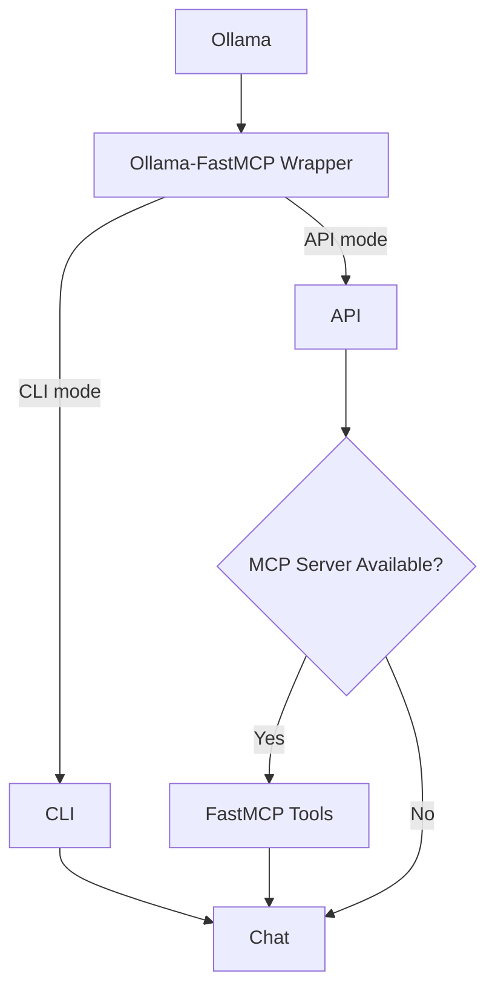

# Ollama-FastMCP Wrapper

A proxy service that bridges [Ollama](https://ollama.ai) with [FastMCP](https://gofastmcp.com) thus allowing models to be used locally in conjunction with MCP servers and their tools directly on the local machine.

---

## ✨ Features

- Connect/disconnect to multiple **MCP servers** at runtime (using FastMCP).
- Expose FastMCP tools as callable functions to Ollama models.
- Use Ollama locally with tool-augmented reasoning.
- Historical conversation with the LLM model persistable on disk.
- Automatically summarise historical conversation with the model.
- Run as:
  - **API Server** (via FastAPI + Uvicorn)
  - **Interactive CLI**

---

## :question: What is MCP?

The Model Context Protocol (MCP) is a protocol that lets you build servers to expose data and functionality to LLM applications in a secure, standardized way. 
Limited to this wrapper, MCP use is limited to the Tools part.

## ⚡ Installation

1. Clone this repository and install dependencies:

   ```bash
   git clone https://github.com/andreamoro/ollama-fastmcp-wrapper.git
   ```

    Install dependencies according to the package manager you are using. If it's uv:

    ```bash
    cd ollama-fastmcp-wrapper
    uv sync
    ```
    Otherwise go with the traditional (obsolete) pip:
    
    ```bash
    cd ollama-fastmcp-wrapper
    pip install -r requirements.txt
    ```

&nbsp;&nbsp;&nbsp;&nbsp;&nbsp;&nbsp; Python requirements include:<br>
&nbsp;&nbsp;&nbsp;&nbsp;&nbsp;&nbsp; - fastapi<br>
&nbsp;&nbsp;&nbsp;&nbsp;&nbsp;&nbsp; - fastmcp<br>
&nbsp;&nbsp;&nbsp;&nbsp;&nbsp;&nbsp; - uvicorn<br>
&nbsp;&nbsp;&nbsp;&nbsp;&nbsp;&nbsp; - ollama<br>

2. Make sure you have:
- [Ollama Client](https://ollama.com/download) up and running: 
  ```bash
  ollama serve
  ```
- An MCP server to use the Tools capability
  - Without an MCP server, you can use this wrapper as a conversation interface
  - Two example MCP servers are included in the `mcp_servers/` directory:
    - **math_server.py** - Basic arithmetic operations (add, subtract, multiply, divide)
    - **ipinfo_server.py** - IP geolocation lookup with 20 preset organizations

## &#9973; Usage

Run the wrapper:

```bash
python ollama_wrapper.py
```

You'll be asked which mode to start in:

- **API mode** → starts a REST API on `http://127.0.0.1:8000`
- **CLI mode** → starts a terminal-based chat loop

### 📚 Demo Scripts

The `demos/` directory contains comprehensive usage examples in both shell and Python formats:

- **basic_chat** - Simple chat without tools
- **math_operations** - Using the math MCP server
- **ipinfo_lookup** - IP geolocation queries
- **server_management** - Connect/disconnect/list servers
- **history_management** - Conversation persistence

See [`demos/README.md`](demos/README.md) for detailed instructions and prerequisites.

---

### 🖥️ API Mode

Start the API:

```bash
python ollama_wrapper.py
# choose "api"
```

Endpoints:

**Root:**
- `GET /` → API documentation and endpoint listing

**Chat:**
- `POST /chat` → Send a chat request (with optional MCP tools)

**History:**
- `GET /history` → Get current conversation history
- `GET /history/clear` → Clear the current conversation history
- `GET /history/load/{file_name}` → Load conversation history from disk
- `GET /history/overwrite/{file_name}` → Overwrite an existing conversation file
- `GET /history/save/{file_name}` → Save conversation history to disk

**Models:**
- `GET /models` → List installed Ollama models with details

**Servers:**
- `GET /servers` → List available FastMCP servers from config
- `POST /servers/{server_name}/connect` → Connect to an MCP server
- `POST /servers/{server_name}/disconnect` → Disconnect from an MCP server
- `GET /servers/{server_name}/tools` → List available tools for a specific MCP server

#### Usage Scenarios

**Scenario 1: Using Tools (Requires Explicit Connection)**
```bash
# ⚠️ IMPORTANT (v0.5.0+): Servers must be explicitly connected before use

# Step 1: Connect to MCP server
curl -X POST http://localhost:8000/servers/math/connect

# Step 2: Chat with tools
curl http://localhost:8000/chat -H "Content-Type: application/json" -d '{
  "message": "Add 5 and 10, then multiply the result by 20.",
  "model": "llama3.2:3b",
  "mcp_server": "math"
}'

# If you forget to connect first, you'll get a clear error:
# HTTP 400: Server 'math' is not connected. Please connect first using POST /servers/math/connect
```

**Scenario 2: Pure Chat (no tools)**
```bash
# Use empty mcp_server for pure Ollama chat without tools
curl http://localhost:8000/chat -H "Content-Type: application/json" -d '{
  "message": "Hello, how are you?",
  "model": "llama3.2:3b",
  "mcp_server": ""
}'
# No tools are sent to Ollama, faster response
```

**Scenario 3: Stateless Mode (One-Shot Requests)**
```bash
# Use stateless mode for independent, single-turn interactions
curl http://localhost:8000/chat -H "Content-Type: application/json" -d '{
  "message": "Translate this to French: Hello world",
  "model": "llama3.2:3b",
  "mcp_server": "",
  "stateless": true
}'
# Message is not added to history - ideal for:
#   - API integrations requiring stateless behavior
#   - Batch processing multiple independent requests
#   - Microservices that don't need conversation context
#   - Parallel request processing without interference
```

**Scenario 4: Custom Temperature for Creative Tasks**
```bash
# Override default temperature for more creative responses
curl http://localhost:8000/chat -H "Content-Type: application/json" -d '{
  "message": "Write a creative poem about programming",
  "model": "llama3.2:3b",
  "mcp_server": "",
  "temperature": 1.5
}'
# Higher temperature (1.5) produces more creative, varied responses

# Response includes performance metrics:
# {
#   "response": "...",
#   "tools_used": [],
#   "metrics": {
#     "prompt_tokens": 45,
#     "completion_tokens": 120,
#     "tokens_per_second": 42.5,
#     "total_duration_s": 2.82,
#     "eval_duration_s": 2.12,
#     "prompt_eval_duration_s": 0.68
#   }
# }
```

**Scenario 5: Discovering Available Models**
```bash
# List all installed Ollama models
curl http://localhost:8000/models

# Response includes model details:
# {
#   "models": [
#     {
#       "name": "llama3.2:3b",
#       "size": 2019393189,
#       "size_gb": 2.02,
#       "family": "llama",
#       "parameter_size": "3.2B",
#       "quantization": "Q4_K_M"
#     }
#   ],
#   "count": 1
# }
```

**Scenario 6: Managing Server Connections**
```bash
# List available servers
curl http://localhost:8000/servers

# Disconnect a server
curl -X POST http://localhost:8000/servers/math/disconnect

# Get conversation history
curl http://localhost:8000/history
```

---

### 💬 CLI Mode

```bash
python ollama_wrapper.py
# choose "cli"
```

Then type messages:

```
You: Hello!
Bot: Hi there
```

Exit with `/exit` or `/quit`.

---

## ⚙️ Configuration

### Configuration Files

Version 0.4.0 introduces a separated configuration structure:

1. **Wrapper Configuration** (`wrapper_config.toml` - root directory):
   ```toml
   [wrapper]
   transport = "HTTP"              # Transport method: "HTTP" or "STDIO" (default: HTTP)
   host = "0.0.0.0"                # Server host address (default: 0.0.0.0)
   port = 8000                     # Server port (default: 8000)
   history_file = ""               # Path to conversation history file (default: none)
   overwrite_history = false       # Overwrite history file on exit (default: false)
   model = { default = "llama3.2:3b", temperature = 0.2 }  # Model settings
   ```

   **Model Settings:**
   - `default`: Default model name if not specified in requests
   - `temperature`: Controls response randomness (0.0-2.0)
     - Low (0.0-0.3): Consistent, deterministic responses (recommended for factual tasks)
     - Medium (0.7-1.0): Balanced creativity
     - High (1.5-2.0): Very creative, less predictable
   - Temperature can be overridden per request via API

2. **MCP Servers Configuration** (`mcp_servers/mcp_servers_config.toml`):
   ```toml
   [[servers]]
   name = "math"
   command = "uv"
   args = ["run", "--with", "fastmcp", "mcp_servers/math_server.py"]
   host = "http://localhost:5000/mcp"
   port = 5000
   enabled = true

   [[servers]]
   name = "ipinfo"
   command = "uv"
   args = ["run", "--with", "fastmcp", "mcp_servers/ipinfo_server.py"]
   host = "http://localhost:5001/mcp"
   port = 5001
   enabled = true
   token_file = "mcp_tokens.toml"  # Optional: specify token file (default: mcp_tokens.toml)
   ```

3. **API Tokens** (`mcp_servers/mcp_tokens.toml` - gitignored):
   ```toml
   # Copy from mcp_tokens.toml.example and add your tokens
   [ipinfo]
   token = "your_ipinfo_token_here"
   ```

### Configuration Priority

Command-line arguments take precedence over config file settings:
- If you specify `--host` or `--port` on the command line, those values will be used
- If not specified on command line, values from `wrapper_config.toml` will be used
- If not in config file, default values will be used

### Transport Methods

- **STDIO transport** → spawn server locally
- **HTTP transport** → connect to remote MCP server

### Command-Line Arguments

**Positional Arguments:**
- `mode` - Operation mode: `api` or `cli` (default: `api`)
- `model` - Ollama model to use (e.g., `llama3.2:3b`, `gemma3:1b`)

**Optional Arguments:**
- `-c, --wrapper-config <file>` - Path to wrapper configuration file (default: `wrapper_config.toml`)
- `--mcp-config <filename>` - MCP servers config filename in mcp_servers/ directory (default: `mcp_servers_config.toml`)
- `--history-file <file>` - Path to conversation history file to load/save
- `-o, --overwrite-history` - Allow overwriting existing history file
- `-t, --transport <method>` - Transport method: `HTTP` or `STDIO` (default: from config or `HTTP`)
- `--host <address>` - API server host address (default: from config or `0.0.0.0`)
- `--port <number>` - API server port number (default: from config or `8000`)

#### Examples

```bash
# Use custom wrapper config file
python ollama_wrapper.py api -c my_wrapper_config.toml

# Override config file settings
python ollama_wrapper.py api --host 127.0.0.1 --port 9000

# Specify transport method
python ollama_wrapper.py api -t STDIO

# Load conversation history
python ollama_wrapper.py cli --history-file my_conversation.json

# Start with specific model and auto-save history
python ollama_wrapper.py api llama3.2:3b --history-file conversation.json -o

# Use alternate MCP servers config
python ollama_wrapper.py api --mcp-config alternate_servers.toml
```

---

## 📊 Architecture Diagram



---

## :bulb: Release History / Roadmap

Please check the [Changelog](CHANGELOG.md) file for more information.

---

## License

MIT License © 2025 Andrea MORO

