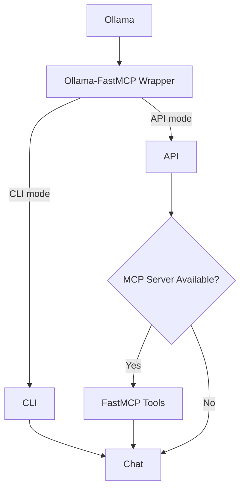

# Ollama-FastMCP Wrapper

A proxy service that bridges [Ollama](https://ollama.ai) with [FastMCP](https://gofastmcp.com) thus allowing models to be used locally in conjunction with MCP servers and their tools directly on the local machine.

---

## ✨ Features

- Connect/disconnect to multiple **MCP servers** at runtime (using FastMCP).
- Expose FastMCP tools as callable functions to Ollama models.
- Use Ollama locally with tool-augmented reasoning.
- Historical conversation with the LLM model persistable on disk.
- Automatically summarise historical conversation with the model.
- Run as:
  - **API Server** (via FastAPI + Uvicorn)
  - **Interactive CLI**

---

## :question: What is MCP?

The Model Context Protocol (MCP) is a protocol that lets you build servers to expose data and functionality to LLM applications in a secure, standardized way. 
Limited to this wrapper, MCP use is limited to the Tools part.

## ⚡ Installation

1. Clone this repository and install dependencies:

   ```bash
   git clone https://github.com/andreamoro/ollama-fastmcp-wrapper.git
   ```

    Install dependencies according to the package manager you are using. If it's uv:

    ```bash
    cd ollama-fastmcp-wrapper
    uv sync
    ```
    Otherwise go with the traditional (obsolete) pip:
    
    ```bash
    cd ollama-fastmcp-wrapper
    pip install -r requirements.txt
    ```

&nbsp;&nbsp;&nbsp;&nbsp;&nbsp;&nbsp; Python requirements include:<br>
&nbsp;&nbsp;&nbsp;&nbsp;&nbsp;&nbsp; - fastapi<br>
&nbsp;&nbsp;&nbsp;&nbsp;&nbsp;&nbsp; - fastmcp<br>
&nbsp;&nbsp;&nbsp;&nbsp;&nbsp;&nbsp; - uvicorn<br>
&nbsp;&nbsp;&nbsp;&nbsp;&nbsp;&nbsp; - ollama<br>

2. Make sure you have:
- [Ollama Client](https://ollama.com/download) up and running: 
  ```bash
  ollama serve
  ```
- An MCP server to use the Tools capability
  - Without an MCP server, you can use this wrapper as a conversation interface 
  - A simple math MCP server is available in the repository.

## &#9973; Usage

Run the wrapper:

```bash
python ollama_wrapper.py
```

You’ll be asked which mode to start in:

- **API mode** → starts a REST API on `http://127.0.0.1:8000`
- **CLI mode** → starts a terminal-based chat loop

---

### 🖥️ API Mode

Start the API:

```bash
python ollama_wrapper.py
# choose "api"
```

Endpoints:

- `GET /servers` → List available FastMCP servers
- `POST /connect/{server_name}` → Connect a FastMCP server
- `POST /disconnect/{server_name}` → Disconnect a server
- `GET /list_tools?server_name={server_name}` → List tools for a server
- `POST /chat` → Send a chat request
- `POST /save_history/{file_name}` → Persists the conversation history on disk
- `POST /overwrite_history/{file_name}` → Overwrite an existing conversation file with the ongoing conversation

Example:

```bash
$ > curl -X POST http://0.0.0.0:8000/connect/math
$ > {"status_code":200,"detail":"math server successfully connected."}

$ > curl http://127.0.0.1:8000/chat -H "Content-Type: application/json" -d '{
      "message": "Add 5 and 10, then multiply the result by 20.",
      "model": "llama3.2:3b",
      "mcp_server": "math"
    }'
$ > ...
```

---

### 💬 CLI Mode

```bash
python ollama_wrapper.py
# choose "cli"
```

Then type messages:

```
You: Hello!
Bot: Hi there
```

Exit with `/exit` or `/quit`.

---

## ⚙️ Configuration

FastMCP servers are configured in `FASTMCP_SERVERS` inside `ollama_wrapper.py`. Example:

```python
FASTMCP_SERVERS = {
    "math": {
        "name": "math_server",
        "command": "uv",
        "args": ["run", "--with", "fastmcp", "math_server.py"],
        "host": "http://localhost:5000/mcp",
    }
}
```

- **STDIO transport** → spawn server locally
- **HTTP transport** → connect to remote MCP server

---

## 📊 Architecture Diagram



---

## :bulb: Roadmap / TODO

- Implement FastMCP support in the CLI mode
- Add argument parser for configuring the API host.
- Logging support

---

## Release History

- 2025-09-02 - v. 0.2.0 - Added external MCP config file support and argument parser
- 2025-08-19 - v. 0.1.0 - Initial Release

---

## License

MIT License © 2025 Andrea MORO

